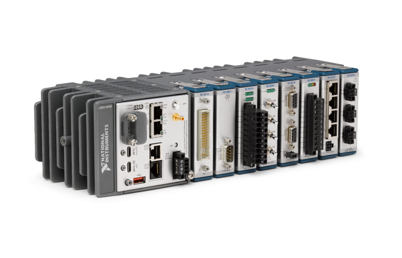
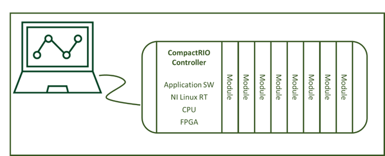
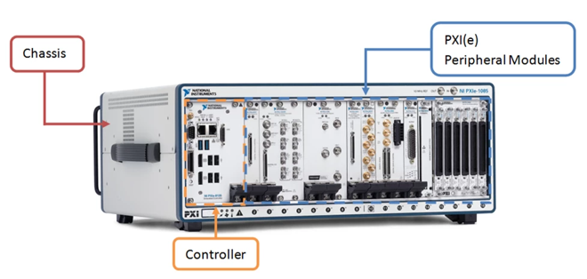
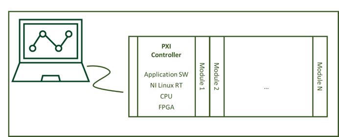

.. _general-system-description:

==========================
General System Description
==========================

This section includes a general description of NI Linux RT.

.. _system-function-or-purpose:

--------------------------
System Function or purpose
--------------------------

NI Linux RT software is deployed on Operational Technology (OT) systems
for control, monitoring, and measurement systems, including the
CompactRIO and PXI Express instrumentation platforms.

   A CompactRIO system

   cRIO Development architecture

The *CompactRIO* ("cRIO") platform pairs a cRIO controller (an
embedded PC) with 4-8 *C-Series* expansion slots in a small, ruggedized
chassis. Users control their C-Series devices either using NI's DAQmx
API or by programming an onboard FPGA using LabVIEW FPGA. CompactRIO
embedded controllers run NI Linux RT.

..
   _Need a new page so the following paragraph does not float to above the related figures
   _Use figure instead of image sp that the caption is displayed

.. raw:: latex

    \newpage

   A PXI system

   PXI Development architecture

The *PXI Express* ("PXIe" or "PXI") platform adapts the PCI
Express bus for the needs of test and measurement applications using
*CompactPCI Express* technology. PXIe pairs a system controller
(typically an embedded PC) with 2-18 PXIe slots in an active backplane.
The controller may run any compatible OS, including Windows, supported
third-party Linux desktop distributions, or NI Linux RT.

NI Linux Real-Time ("NI Linux RT") is an embedded Linux distribution for
real-time application development across NI's embedded controllers.
Users develop their real-time applications on a network-connnected host
system, then deploy to the NI Linux RT controller. Supported programming
languages for real-time development include LabVIEW and C/C++; embedded
programming in Python is also supported. Applications may be deployed
with or without network connectivity.

Alternatively, end users may program the device directly, using shell
access and embedded UI. They may also directly connect with a keyboard,
mouse and monitor, by launching a shortcut to the terminal.

For the purposes of this document, NI Linux RT is restricted to the
Operating System running on these devices.

.. _security-overview:

-----------------
Security Overview
-----------------

The NI Linux RT team follows the NI Secure Development Lifecycle Process
and Policies defined by the NI product security team. The NI SDL is part
of NI's Software Engineering Process required for all software
development. The process enforces policies recommended by the Open Web
Application Security Project (OWASP). The process includes:

-  Threat modeling

-  Automated security testing

-  Static analysis security testing

-  Software composition analysis

-  Dynamic analysis security testing

-  Vulnerability identification and documentation

-  Supply chain security

.. _status-definitions:

------------------
Status Definitions
------------------

Throughout this document, we use the following definitions of the status
of each control:

**Implemented by vendor -** The requirement is met by the vendor (NI)
within the product and no further configuration is required by the end
user.

**Not implemented by vendor** - The requirement is not currently met by
the vendor.

**Must be implemented by end user** - The requirement may be met by the
product, but meeting the re­quirement depends on configuration or
deployment actions by the end user.

**Not applicable** - The requirement does not apply to the NI Linux
Real-Time OS. The requirement may still be a requirement to the overall
system which must be met by the system owner.

.. _methodology:

-----------
Methodology
-----------

Each of the following controls contains the following sections:

**Requirement number and title** - As listed in NIST 800-171 Rev 3.
Numbering is maintained from NIST 800-171.

**Control Descriptions** - With text directly from NIST 800-171 Rev 3.

**Discussion** - With text directly from NIST 800-171 Rev 3.

**Implementation Status** - How NILRT SNAC configuration meets the
control.

**Solution Implementation** - Commentary on how the status is determined
for the control, with information relevant to the end user related to
the control.

NIST 800-171 Rev 3 is available at
https://csrc.nist.gov/pubs/sp/800/171/r3/final.

=====================
NIST 800-171 Controls
=====================

.. _controls-summary:

----------------
Controls Summary
----------------

This table lists the compliance of NI Linux RT to the NIST 800-171
controls. This table lists only those controls which have not been
withdrawn.

.. tabularcolumns:: |\Y{0.15}|\Y{0.45}|\Y{0.4}|

+----------------------------------------------------------------------------------------+----------------------------------------------------------------------------------------------------------------------------------------------+----------------------------------+
| :ref:`3.1. <3-1--access-control>`                                                      | :ref:`Access Control <3-1--access-control>`                                                                                                  |                                  |
+----------------------------------------------------------------------------------------+----------------------------------------------------------------------------------------------------------------------------------------------+----------------------------------+
| :ref:`3.1.1. <3-1-1--account-management>`                                              | :ref:`Account Management <3-1-1--account-management>`                                                                                        | Must be implemented by end user  |
+----------------------------------------------------------------------------------------+----------------------------------------------------------------------------------------------------------------------------------------------+----------------------------------+
| :ref:`3.1.2. <3-1-2--access-enforcement>`                                              | :ref:`Access Enforcement <3-1-2--access-enforcement>`                                                                                        | Must be implemented by end user  |
+----------------------------------------------------------------------------------------+----------------------------------------------------------------------------------------------------------------------------------------------+----------------------------------+
| :ref:`3.1.3. <3-1-3--flow-enforcement>`                                                | :ref:`Flow Enforcement <3-1-3--flow-enforcement>`                                                                                            | Not Applicable                   |
+----------------------------------------------------------------------------------------+----------------------------------------------------------------------------------------------------------------------------------------------+----------------------------------+
| :ref:`3.1.4. <3-1-4--separation-of-duties>`                                            | :ref:`Separation of Duties <3-1-4--separation-of-duties>`                                                                                    | Must be implemented by end user  |
+----------------------------------------------------------------------------------------+----------------------------------------------------------------------------------------------------------------------------------------------+----------------------------------+
| :ref:`3.1.5. <3-1-5--least-privilege>`                                                 | :ref:`Least Privilege <3-1-5--least-privilege>`                                                                                              | Not implemented by vendor        |
+----------------------------------------------------------------------------------------+----------------------------------------------------------------------------------------------------------------------------------------------+----------------------------------+
| :ref:`3.1.6. <3-1-6--least-privilege---privileged-accounts>`                           | :ref:`Least Privilege - Privileged Accounts <3-1-6--least-privilege---privileged-accounts>`                                                  | Must be implemented by end user  |
+----------------------------------------------------------------------------------------+----------------------------------------------------------------------------------------------------------------------------------------------+----------------------------------+
| :ref:`3.1.7. <3-1-7--least-privilege---privileged-functions>`                          | :ref:`Least Privilege - Privileged Functions <3-1-7--least-privilege---privileged-functions>`                                                | Implemented by vendor            |
+----------------------------------------------------------------------------------------+----------------------------------------------------------------------------------------------------------------------------------------------+----------------------------------+
| :ref:`3.1.8. <3-1-8--unsuccessful-logon-attempts>`                                     | :ref:`Unsuccessful Logon Attempts <3-1-8--unsuccessful-logon-attempts>`                                                                      | Implemented by vendor            |
+----------------------------------------------------------------------------------------+----------------------------------------------------------------------------------------------------------------------------------------------+----------------------------------+
| :ref:`3.1.9. <3-1-9--system-use-notification>`                                         | :ref:`System Use Notification <3-1-9--system-use-notification>`                                                                              | Must be implemented by end user  |
+----------------------------------------------------------------------------------------+----------------------------------------------------------------------------------------------------------------------------------------------+----------------------------------+
| :ref:`3.1.10. <3-1-10--device-lock>`                                                   | :ref:`Device Lock <3-1-10--device-lock>`                                                                                                     | Implemented by vendor            |
+----------------------------------------------------------------------------------------+----------------------------------------------------------------------------------------------------------------------------------------------+----------------------------------+
| :ref:`3.1.11. <3-1-11--session-termination>`                                           | :ref:`Session Termination <3-1-11--session-termination>`                                                                                     | Implemented by vendor            |
+----------------------------------------------------------------------------------------+----------------------------------------------------------------------------------------------------------------------------------------------+----------------------------------+
| :ref:`3.1.12. <3-1-12--remote-access>`                                                 | :ref:`Remote Access <3-1-12--remote-access>`                                                                                                 | Not Applicable                   |
+----------------------------------------------------------------------------------------+----------------------------------------------------------------------------------------------------------------------------------------------+----------------------------------+
| :ref:`3.1.16. <3-1-16--wireless-access>`                                               | :ref:`Wireless Access <3-1-16--wireless-access>`                                                                                             | Not Applicable                   |
+----------------------------------------------------------------------------------------+----------------------------------------------------------------------------------------------------------------------------------------------+----------------------------------+
| :ref:`3.1.18. <3-1-18--access-control-for-mobile-devices>`                             | :ref:`Access Control for Mobile Devices <3-1-18--access-control-for-mobile-devices>`                                                         | Not Applicable                   |
+----------------------------------------------------------------------------------------+----------------------------------------------------------------------------------------------------------------------------------------------+----------------------------------+
| :ref:`3.1.20. <3-1-20--use-of-external-systems>`                                       | :ref:`Use of External Systems <3-1-20--use-of-external-systems>`                                                                             | Not Applicable                   |
+----------------------------------------------------------------------------------------+----------------------------------------------------------------------------------------------------------------------------------------------+----------------------------------+
| :ref:`3.1.21. <3-1-21--external-systems---limits-and-restrictions-on-authorized-use>`  | :ref:`External Systems - Limits and Restrictions on Authorized Use <3-1-21--external-systems---limits-and-restrictions-on-authorized-use>`   | Not Applicable                   |
+----------------------------------------------------------------------------------------+----------------------------------------------------------------------------------------------------------------------------------------------+----------------------------------+
| :ref:`3.1.22. <3-1-22--publicly-accessible-content>`                                   | :ref:`Publicly Accessible Content <3-1-22--publicly-accessible-content>`                                                                     | Not Applicable                   |
+----------------------------------------------------------------------------------------+----------------------------------------------------------------------------------------------------------------------------------------------+----------------------------------+
| :ref:`3.2. <3-2--awareness-and-training>`                                              | :ref:`Awareness and Training <3-2--awareness-and-training>`                                                                                  |                                  |
+----------------------------------------------------------------------------------------+----------------------------------------------------------------------------------------------------------------------------------------------+----------------------------------+
| :ref:`3.2.1. <3-2-1--literacy-training-and-awareness>`                                 | :ref:`Literacy Training and Awareness <3-2-1--literacy-training-and-awareness>`                                                              | Not Applicable                   |
+----------------------------------------------------------------------------------------+----------------------------------------------------------------------------------------------------------------------------------------------+----------------------------------+
| :ref:`3.2.2. <3-2-2--role-based-training>`                                             | :ref:`Role-Based Training <3-2-2--role-based-training>`                                                                                      | Not Applicable                   |
+----------------------------------------------------------------------------------------+----------------------------------------------------------------------------------------------------------------------------------------------+----------------------------------+
| :ref:`3.3. <3-3--audit-and-accountability>`                                            | :ref:`Audit and Accountability <3-3--audit-and-accountability>`                                                                              |                                  |
+----------------------------------------------------------------------------------------+----------------------------------------------------------------------------------------------------------------------------------------------+----------------------------------+
| :ref:`3.3.1. <3-3-1--event-logging>`                                                   | :ref:`Event Logging <3-3-1--event-logging>`                                                                                                  | Implemented by vendor            |
+----------------------------------------------------------------------------------------+----------------------------------------------------------------------------------------------------------------------------------------------+----------------------------------+
| :ref:`3.3.2. <3-3-2--audit-record-content>`                                            | :ref:`Audit Record Content <3-3-2--audit-record-content>`                                                                                    | Implemented by vendor            |
+----------------------------------------------------------------------------------------+----------------------------------------------------------------------------------------------------------------------------------------------+----------------------------------+
| :ref:`3.3.3. <3-3-3--audit-record-generation>`                                         | :ref:`Audit Record Generation <3-3-3--audit-record-generation>`                                                                              | Implemented by vendor            |
+----------------------------------------------------------------------------------------+----------------------------------------------------------------------------------------------------------------------------------------------+----------------------------------+
| :ref:`3.3.4. <3-3-4--response-to-audit-logging-process-failures>`                      | :ref:`Response to Audit Logging Process Failures <3-3-4--response-to-audit-logging-process-failures>`                                        | Must be implemented by end user  |
+----------------------------------------------------------------------------------------+----------------------------------------------------------------------------------------------------------------------------------------------+----------------------------------+
| :ref:`3.3.5. <3-3-5--audit-record-review--analysis--and-reporting>`                    | :ref:`Audit Record Review, Analysis, and Reporting <3-3-5--audit-record-review--analysis--and-reporting>`                                    | Not Applicable                   |
+----------------------------------------------------------------------------------------+----------------------------------------------------------------------------------------------------------------------------------------------+----------------------------------+
| :ref:`3.3.6. <3-3-6--audit-record-reduction-and-report-generation>`                    | :ref:`Audit Record Reduction and Report Generation <3-3-6--audit-record-reduction-and-report-generation>`                                    | Not Applicable                   |
+----------------------------------------------------------------------------------------+----------------------------------------------------------------------------------------------------------------------------------------------+----------------------------------+
| :ref:`3.3.7. <3-3-7--time-stamps>`                                                     | :ref:`Time Stamps <3-3-7--time-stamps>`                                                                                                      | Implemented by vendor            |
+----------------------------------------------------------------------------------------+----------------------------------------------------------------------------------------------------------------------------------------------+----------------------------------+
| :ref:`3.3.8. <3-3-8--protection-of-audit-information>`                                 | :ref:`Protection of Audit Information <3-3-8--protection-of-audit-information>`                                                              | Implemented by vendor            |
+----------------------------------------------------------------------------------------+----------------------------------------------------------------------------------------------------------------------------------------------+----------------------------------+
| :ref:`3.4. <3-4--configuration-management>`                                            | :ref:`Configuration Management <3-4--configuration-management>`                                                                              |                                  |
+----------------------------------------------------------------------------------------+----------------------------------------------------------------------------------------------------------------------------------------------+----------------------------------+
| :ref:`3.4.1. <3-4-1--baseline-configuration>`                                          | :ref:`Baseline Configuration <3-4-1--baseline-configuration>`                                                                                | Must be implemented by end user  |
+----------------------------------------------------------------------------------------+----------------------------------------------------------------------------------------------------------------------------------------------+----------------------------------+
| :ref:`3.4.2. <3-4-2--configuration-settings>`                                          | :ref:`Configuration Settings <3-4-2--configuration-settings>`                                                                                | Implemented by vendor            |
+----------------------------------------------------------------------------------------+----------------------------------------------------------------------------------------------------------------------------------------------+----------------------------------+
| :ref:`3.4.3. <3-4-3--configuration-change-control>`                                    | :ref:`Configuration Change Control <3-4-3--configuration-change-control>`                                                                    | Not Applicable                   |
+----------------------------------------------------------------------------------------+----------------------------------------------------------------------------------------------------------------------------------------------+----------------------------------+
| :ref:`3.4.4. <3-4-4--impact-analyses>`                                                 | :ref:`Impact Analyses <3-4-4--impact-analyses>`                                                                                              | Not Applicable                   |
+----------------------------------------------------------------------------------------+----------------------------------------------------------------------------------------------------------------------------------------------+----------------------------------+
| :ref:`3.4.5. <3-4-5--access-restrictions-for-change>`                                  | :ref:`Access Restrictions for Change <3-4-5--access-restrictions-for-change>`                                                                | Not Applicable                   |
+----------------------------------------------------------------------------------------+----------------------------------------------------------------------------------------------------------------------------------------------+----------------------------------+
| :ref:`3.4.6. <3-4-6--least-functionality>`                                             | :ref:`Least Functionality <3-4-6--least-functionality>`                                                                                      | Must be implemented by end user  |
+----------------------------------------------------------------------------------------+----------------------------------------------------------------------------------------------------------------------------------------------+----------------------------------+
| :ref:`3.4.8. <3-4-8--authorized-software---allow-by-exception>`                        | :ref:`Authorized Software - Allow by Exception <3-4-8--authorized-software---allow-by-exception>`                                            | Must be implemented by end user  |
+----------------------------------------------------------------------------------------+----------------------------------------------------------------------------------------------------------------------------------------------+----------------------------------+
| :ref:`3.4.10. <3-4-10--system-component-inventory>`                                    | :ref:`System Component Inventory <3-4-10--system-component-inventory>`                                                                       | Implemented by vendor            |
+----------------------------------------------------------------------------------------+----------------------------------------------------------------------------------------------------------------------------------------------+----------------------------------+
| :ref:`3.4.11. <3-4-11--information-location>`                                          | :ref:`Information Location <3-4-11--information-location>`                                                                                   | Must be implemented by end user  |
+----------------------------------------------------------------------------------------+----------------------------------------------------------------------------------------------------------------------------------------------+----------------------------------+
| :ref:`3.4.12. <3-4-12--system-and-component-configuration-for-high-risk-areas>`        | :ref:`System and Component Configuration for High-Risk Areas <3-4-12--system-and-component-configuration-for-high-risk-areas>`               | Not Applicable                   |
+----------------------------------------------------------------------------------------+----------------------------------------------------------------------------------------------------------------------------------------------+----------------------------------+
| :ref:`3.5. <3-5--identification-and-authentication>`                                   | :ref:`Identification and Authentication <3-5--identification-and-authentication>`                                                            |                                  |
+----------------------------------------------------------------------------------------+----------------------------------------------------------------------------------------------------------------------------------------------+----------------------------------+
| :ref:`3.5.1. <3-5-1--user-identification--authentication--and-re-authentication>`      | :ref:`User Identification, Authentication, and Re-Authentication <3-5-1--user-identification--authentication--and-re-authentication>`        | Not implemented by vendor        |
+----------------------------------------------------------------------------------------+----------------------------------------------------------------------------------------------------------------------------------------------+----------------------------------+
| :ref:`3.5.2. <3-5-2--device-identification-and-authentication>`                        | :ref:`Device Identification and Authentication <3-5-2--device-identification-and-authentication>`                                            | Not implemented by vendor        |
+----------------------------------------------------------------------------------------+----------------------------------------------------------------------------------------------------------------------------------------------+----------------------------------+
| :ref:`3.5.3. <3-5-3--multi-factor-authentication>`                                     | :ref:`Multi-Factor Authentication <3-5-3--multi-factor-authentication>`                                                                      | Not Applicable                   |
+----------------------------------------------------------------------------------------+----------------------------------------------------------------------------------------------------------------------------------------------+----------------------------------+
| :ref:`3.5.4. <3-5-4--replay-resistant-authentication>`                                 | :ref:`Replay-Resistant Authentication <3-5-4--replay-resistant-authentication>`                                                              | Not implemented by vendor        |
+----------------------------------------------------------------------------------------+----------------------------------------------------------------------------------------------------------------------------------------------+----------------------------------+
| :ref:`3.5.5. <3-5-5--identifier-management>`                                           | :ref:`Identifier Management <3-5-5--identifier-management>`                                                                                  | Not Applicable                   |
+----------------------------------------------------------------------------------------+----------------------------------------------------------------------------------------------------------------------------------------------+----------------------------------+
| :ref:`3.5.7. <3-5-7--password-management>`                                             | :ref:`Password Management <3-5-7--password-management>`                                                                                      | Implemented by vendor            |
+----------------------------------------------------------------------------------------+----------------------------------------------------------------------------------------------------------------------------------------------+----------------------------------+
| :ref:`3.5.11. <3-5-11--authentication-feedback>`                                       | :ref:`Authentication Feedback <3-5-11--authentication-feedback>`                                                                             | Implemented by vendor            |
+----------------------------------------------------------------------------------------+----------------------------------------------------------------------------------------------------------------------------------------------+----------------------------------+
| :ref:`3.5.12. <3-5-12--authenticator-management>`                                      | :ref:`Authenticator Management <3-5-12--authenticator-management>`                                                                           | Implemented by vendor            |
+----------------------------------------------------------------------------------------+----------------------------------------------------------------------------------------------------------------------------------------------+----------------------------------+
| :ref:`3.6. <3-6--incident-response>`                                                   | :ref:`Incident Response <3-6--incident-response>`                                                                                            |                                  |
+----------------------------------------------------------------------------------------+----------------------------------------------------------------------------------------------------------------------------------------------+----------------------------------+
| :ref:`3.6.1. <3-6-1--incident-response-plan-and-handling>`                             | :ref:`Incident Response Plan and Handling <3-6-1--incident-response-plan-and-handling>`                                                      | Not Applicable                   |
+----------------------------------------------------------------------------------------+----------------------------------------------------------------------------------------------------------------------------------------------+----------------------------------+
| :ref:`3.6.2. <3-6-2--incident-monitoring--reporting--and-response-assistance>`         | :ref:`Incident Monitoring, Reporting, and Response Assistance <3-6-2--incident-monitoring--reporting--and-response-assistance>`              | Not Applicable                   |
+----------------------------------------------------------------------------------------+----------------------------------------------------------------------------------------------------------------------------------------------+----------------------------------+
| :ref:`3.6.3. <3-6-3--incident-response-testing>`                                       | :ref:`Incident Response Testing <3-6-3--incident-response-testing>`                                                                          | Not Applicable                   |
+----------------------------------------------------------------------------------------+----------------------------------------------------------------------------------------------------------------------------------------------+----------------------------------+
| :ref:`3.6.4. <3-6-4--incident-response-training>`                                      | :ref:`Incident Response Training <3-6-4--incident-response-training>`                                                                        | Not Applicable                   |
+----------------------------------------------------------------------------------------+----------------------------------------------------------------------------------------------------------------------------------------------+----------------------------------+
| :ref:`3.7. <3-7--maintenance>`                                                         | :ref:`Maintenance <3-7--maintenance>`                                                                                                        |                                  |
+----------------------------------------------------------------------------------------+----------------------------------------------------------------------------------------------------------------------------------------------+----------------------------------+
| :ref:`3.7.4. <3-7-4--maintenance-tools>`                                               | :ref:`Maintenance Tools <3-7-4--maintenance-tools>`                                                                                          | Not Applicable                   |
+----------------------------------------------------------------------------------------+----------------------------------------------------------------------------------------------------------------------------------------------+----------------------------------+
| :ref:`3.7.5. <3-7-5--nonlocal-maintenance>`                                            | :ref:`Nonlocal Maintenance <3-7-5--nonlocal-maintenance>`                                                                                    | Not Applicable                   |
+----------------------------------------------------------------------------------------+----------------------------------------------------------------------------------------------------------------------------------------------+----------------------------------+
| :ref:`3.7.6. <3-7-6--maintenance-personnel>`                                           | :ref:`Maintenance Personnel <3-7-6--maintenance-personnel>`                                                                                  | Not Applicable                   |
+----------------------------------------------------------------------------------------+----------------------------------------------------------------------------------------------------------------------------------------------+----------------------------------+
| :ref:`3.8. <3-8--media-protection>`                                                    | :ref:`Media Protection <3-8--media-protection>`                                                                                              |                                  |
+----------------------------------------------------------------------------------------+----------------------------------------------------------------------------------------------------------------------------------------------+----------------------------------+
| :ref:`3.8.1. <3-8-1--media-storage>`                                                   | :ref:`Media Storage <3-8-1--media-storage>`                                                                                                  | Not Applicable                   |
+----------------------------------------------------------------------------------------+----------------------------------------------------------------------------------------------------------------------------------------------+----------------------------------+
| :ref:`3.8.2. <3-8-2--media-access>`                                                    | :ref:`Media Access <3-8-2--media-access>`                                                                                                    | Not Applicable                   |
+----------------------------------------------------------------------------------------+----------------------------------------------------------------------------------------------------------------------------------------------+----------------------------------+
| :ref:`3.8.3. <3-8-3--media-sanitization>`                                              | :ref:`Media Sanitization <3-8-3--media-sanitization>`                                                                                        | Not Applicable                   |
+----------------------------------------------------------------------------------------+----------------------------------------------------------------------------------------------------------------------------------------------+----------------------------------+
| :ref:`3.8.4. <3-8-4--media-marking>`                                                   | :ref:`Media Marking <3-8-4--media-marking>`                                                                                                  | Not Applicable                   |
+----------------------------------------------------------------------------------------+----------------------------------------------------------------------------------------------------------------------------------------------+----------------------------------+
| :ref:`3.8.5. <3-8-5--media-transport>`                                                 | :ref:`Media Transport <3-8-5--media-transport>`                                                                                              | Not Applicable                   |
+----------------------------------------------------------------------------------------+----------------------------------------------------------------------------------------------------------------------------------------------+----------------------------------+
| :ref:`3.8.7. <3-8-7--media-use>`                                                       | :ref:`Media Use <3-8-7--media-use>`                                                                                                          | Not Applicable                   |
+----------------------------------------------------------------------------------------+----------------------------------------------------------------------------------------------------------------------------------------------+----------------------------------+
| :ref:`3.8.9. <3-8-9--system-backup---cryptographic-protection>`                        | :ref:`System Backup - Cryptographic Protection <3-8-9--system-backup---cryptographic-protection>`                                            | Not Applicable                   |
+----------------------------------------------------------------------------------------+----------------------------------------------------------------------------------------------------------------------------------------------+----------------------------------+
| :ref:`3.9. <3-9--personnel-security>`                                                  | :ref:`Personnel Security <3-9--personnel-security>`                                                                                          |                                  |
+----------------------------------------------------------------------------------------+----------------------------------------------------------------------------------------------------------------------------------------------+----------------------------------+
| :ref:`3.9.1. <3-9-1--personnel-screening>`                                             | :ref:`Personnel Screening <3-9-1--personnel-screening>`                                                                                      | Not Applicable                   |
+----------------------------------------------------------------------------------------+----------------------------------------------------------------------------------------------------------------------------------------------+----------------------------------+
| :ref:`3.9.2. <3-9-2--personnel-termination-and-transfer>`                              | :ref:`Personnel Termination and Transfer <3-9-2--personnel-termination-and-transfer>`                                                        | Not Applicable                   |
+----------------------------------------------------------------------------------------+----------------------------------------------------------------------------------------------------------------------------------------------+----------------------------------+
| :ref:`3.9.3. <3-9-3--external-personnel-security>`                                     | :ref:`External Personnel Security <3-9-3--external-personnel-security>`                                                                      | Not Applicable                   |
+----------------------------------------------------------------------------------------+----------------------------------------------------------------------------------------------------------------------------------------------+----------------------------------+
| :ref:`3.10. <3-10--physical-protection>`                                               | :ref:`Physical Protection <3-10--physical-protection>`                                                                                       |                                  |
+----------------------------------------------------------------------------------------+----------------------------------------------------------------------------------------------------------------------------------------------+----------------------------------+
| :ref:`3.10.1. <3-10-1--physical-access-authorizations>`                                | :ref:`Physical Access Authorizations <3-10-1--physical-access-authorizations>`                                                               | Not Applicable                   |
+----------------------------------------------------------------------------------------+----------------------------------------------------------------------------------------------------------------------------------------------+----------------------------------+
| :ref:`3.10.2. <3-10-2--monitoring-physical-access>`                                    | :ref:`Monitoring Physical Access <3-10-2--monitoring-physical-access>`                                                                       | Not Applicable                   |
+----------------------------------------------------------------------------------------+----------------------------------------------------------------------------------------------------------------------------------------------+----------------------------------+
| :ref:`3.10.6. <3-10-6--alternate-work-site>`                                           | :ref:`Alternate Work Site <3-10-6--alternate-work-site>`                                                                                     | Not Applicable                   |
+----------------------------------------------------------------------------------------+----------------------------------------------------------------------------------------------------------------------------------------------+----------------------------------+
| :ref:`3.10.7. <3-10-7--physical-access-control>`                                       | :ref:`Physical Access Control <3-10-7--physical-access-control>`                                                                             | Not Applicable                   |
+----------------------------------------------------------------------------------------+----------------------------------------------------------------------------------------------------------------------------------------------+----------------------------------+
| :ref:`3.10.8. <3-10-8--access-control-for-transmission-and-output-devices>`            | :ref:`Access Control for Transmission and Output Devices <3-10-8--access-control-for-transmission-and-output-devices>`                       | Not Applicable                   |
+----------------------------------------------------------------------------------------+----------------------------------------------------------------------------------------------------------------------------------------------+----------------------------------+
| :ref:`3.11. <3-11--risk-assessment>`                                                   | :ref:`Risk Assessment <3-11--risk-assessment>`                                                                                               |                                  |
+----------------------------------------------------------------------------------------+----------------------------------------------------------------------------------------------------------------------------------------------+----------------------------------+
| :ref:`3.11.1. <3-11-1--risk-assessment>`                                               | :ref:`Risk Assessment <3-11-1--risk-assessment>`                                                                                             | Not Applicable                   |
+----------------------------------------------------------------------------------------+----------------------------------------------------------------------------------------------------------------------------------------------+----------------------------------+
| :ref:`3.11.2. <3-11-2--vulnerability-monitoring-and-scanning>`                         | :ref:`Vulnerability Monitoring and Scanning <3-11-2--vulnerability-monitoring-and-scanning>`                                                 | Not Applicable                   |
+----------------------------------------------------------------------------------------+----------------------------------------------------------------------------------------------------------------------------------------------+----------------------------------+
| :ref:`3.11.4. <3-11-4--risk-response>`                                                 | :ref:`Risk Response <3-11-4--risk-response>`                                                                                                 | Not Applicable                   |
+----------------------------------------------------------------------------------------+----------------------------------------------------------------------------------------------------------------------------------------------+----------------------------------+
| :ref:`3.12. <3-12--security-assessment-and-monitoring>`                                | :ref:`Security Assessment and Monitoring <3-12--security-assessment-and-monitoring>`                                                         |                                  |
+----------------------------------------------------------------------------------------+----------------------------------------------------------------------------------------------------------------------------------------------+----------------------------------+
| :ref:`3.12.1. <3-12-1--control-assessments>`                                           | :ref:`Control Assessments <3-12-1--control-assessments>`                                                                                     | Not Applicable                   |
+----------------------------------------------------------------------------------------+----------------------------------------------------------------------------------------------------------------------------------------------+----------------------------------+
| :ref:`3.12.2. <3-12-2--plan-of-action-and-milestones>`                                 | :ref:`Plan of Action and Milestones <3-12-2--plan-of-action-and-milestones>`                                                                 | Not Applicable                   |
+----------------------------------------------------------------------------------------+----------------------------------------------------------------------------------------------------------------------------------------------+----------------------------------+
| :ref:`3.12.3. <3-12-3--continuous-monitoring>`                                         | :ref:`Continuous Monitoring <3-12-3--continuous-monitoring>`                                                                                 | Not Applicable                   |
+----------------------------------------------------------------------------------------+----------------------------------------------------------------------------------------------------------------------------------------------+----------------------------------+
| :ref:`3.12.5. <3-12-5--independent-assessment>`                                        | :ref:`Independent Assessment <3-12-5--independent-assessment>`                                                                               | Not Applicable                   |
+----------------------------------------------------------------------------------------+----------------------------------------------------------------------------------------------------------------------------------------------+----------------------------------+
| :ref:`3.12.6. <3-12-6--information-exchange>`                                          | :ref:`Information Exchange <3-12-6--information-exchange>`                                                                                   | Not Applicable                   |
+----------------------------------------------------------------------------------------+----------------------------------------------------------------------------------------------------------------------------------------------+----------------------------------+
| :ref:`3.12.7. <3-12-7--internal-system-connections>`                                   | :ref:`Internal System Connections <3-12-7--internal-system-connections>`                                                                     | Not Applicable                   |
+----------------------------------------------------------------------------------------+----------------------------------------------------------------------------------------------------------------------------------------------+----------------------------------+
| :ref:`3.13. <3-13--system-and-communications-protection>`                              | :ref:`System and Communications Protection <3-13--system-and-communications-protection>`                                                     |                                  |
+----------------------------------------------------------------------------------------+----------------------------------------------------------------------------------------------------------------------------------------------+----------------------------------+
| :ref:`3.13.1. <3-13-1--boundary-protection>`                                           | :ref:`Boundary Protection <3-13-1--boundary-protection>`                                                                                     | Not Applicable                   |
+----------------------------------------------------------------------------------------+----------------------------------------------------------------------------------------------------------------------------------------------+----------------------------------+
| :ref:`3.13.4. <3-13-4--information-in-shared-system-resources>`                        | :ref:`Information in Shared System Resources <3-13-4--information-in-shared-system-resources>`                                               | Not implemented by vendor        |
+----------------------------------------------------------------------------------------+----------------------------------------------------------------------------------------------------------------------------------------------+----------------------------------+
| :ref:`3.13.6. <3-13-6--network-communications---deny-by-default---allow-by-exception>` | :ref:`Network Communications - Deny by Default - Allow by Exception <3-13-6--network-communications---deny-by-default---allow-by-exception>` | Implemented by end user          |
+----------------------------------------------------------------------------------------+----------------------------------------------------------------------------------------------------------------------------------------------+----------------------------------+
| :ref:`3.13.7. <3-13-7--withdrawn--addressed-by-03-01-12--03-04-02--03-04-06>`          | :ref:`Split Tunneling <3-13-7--withdrawn--addressed-by-03-01-12--03-04-02--03-04-06>`                                                        | Must be implemented by end user  |
+----------------------------------------------------------------------------------------+----------------------------------------------------------------------------------------------------------------------------------------------+----------------------------------+
| :ref:`3.13.8. <3-13-8--transmission-and-storage-confidentiality>`                      | :ref:`Transmission and Storage Confidentiality <3-13-8--transmission-and-storage-confidentiality>`                                           | Must be implemented by end user  |
+----------------------------------------------------------------------------------------+----------------------------------------------------------------------------------------------------------------------------------------------+----------------------------------+
| :ref:`3.13.9. <3-13-9--network-disconnect>`                                            | :ref:`Network Disconnect <3-13-9--network-disconnect>`                                                                                       | Implemented by end user          |
+----------------------------------------------------------------------------------------+----------------------------------------------------------------------------------------------------------------------------------------------+----------------------------------+
| :ref:`3.13.10. <3-13-10--cryptographic-key-establishment-and-management>`              | :ref:`Cryptographic Key Establishment and Management <3-13-10--cryptographic-key-establishment-and-management>`                              | Not Applicable                   |
+----------------------------------------------------------------------------------------+----------------------------------------------------------------------------------------------------------------------------------------------+----------------------------------+
| :ref:`3.13.11. <3-13-11--cryptographic-protection>`                                    | :ref:`Cryptographic Protection <3-13-11--cryptographic-protection>`                                                                          | Must be implemented by end user  |
+----------------------------------------------------------------------------------------+----------------------------------------------------------------------------------------------------------------------------------------------+----------------------------------+
| :ref:`3.13.12. <3-13-12--collaborative-computing-devices-and-applications>`            | :ref:`Collaborative Computing Devices and Applications <3-13-12--collaborative-computing-devices-and-applications>`                          | Not Applicable                   |
+----------------------------------------------------------------------------------------+----------------------------------------------------------------------------------------------------------------------------------------------+----------------------------------+
| :ref:`3.13.13. <3-13-13--mobile-code>`                                                 | :ref:`Mobile Code <3-13-13--mobile-code>`                                                                                                    | Implemented by vendor            |
+----------------------------------------------------------------------------------------+----------------------------------------------------------------------------------------------------------------------------------------------+----------------------------------+
| :ref:`3.13.15. <3-13-15--session-authenticity>`                                        | :ref:`Session Authenticity <3-13-15--session-authenticity>`                                                                                  | Must be implemented by end user  |
+----------------------------------------------------------------------------------------+----------------------------------------------------------------------------------------------------------------------------------------------+----------------------------------+
| :ref:`3.13.17. <3-13-17--internal-network-communications-traffic>`                     | :ref:`Internal Network Communications Traffic <3-13-17--internal-network-communications-traffic>`                                            | Not Applicable                   |
+----------------------------------------------------------------------------------------+----------------------------------------------------------------------------------------------------------------------------------------------+----------------------------------+
| :ref:`3.13.18. <3-13-18--system-access-points>`                                        | :ref:`System Access Points <3-13-18--system-access-points>`                                                                                  | Must be implemented by end user  |
+----------------------------------------------------------------------------------------+----------------------------------------------------------------------------------------------------------------------------------------------+----------------------------------+
| :ref:`3.14. <3-14--system-and-information-integrity>`                                  | :ref:`System and Information Integrity <3-14--system-and-information-integrity>`                                                             |                                  |
+----------------------------------------------------------------------------------------+----------------------------------------------------------------------------------------------------------------------------------------------+----------------------------------+
| :ref:`3.14.1. <3-14-1--flaw-remediation>`                                              | :ref:`Flaw Remediation <3-14-1--flaw-remediation>`                                                                                           | Must be implemented by end user  |
+----------------------------------------------------------------------------------------+----------------------------------------------------------------------------------------------------------------------------------------------+----------------------------------+
| :ref:`3.14.2. <3-14-2--malicious-code-protection>`                                     | :ref:`Malicious Code Protection <3-14-2--malicious-code-protection>`                                                                         | Not implemented by vendor        |
+----------------------------------------------------------------------------------------+----------------------------------------------------------------------------------------------------------------------------------------------+----------------------------------+
| :ref:`3.14.3. <3-14-3--security-alerts--advisories--and-directives>`                   | :ref:`Security Alerts, Advisories, and Directives <3-14-3--security-alerts--advisories--and-directives>`                                     | Must be implemented by end user  |
+----------------------------------------------------------------------------------------+----------------------------------------------------------------------------------------------------------------------------------------------+----------------------------------+
| :ref:`3.14.6. <3-14-6--system-monitoring>`                                             | :ref:`System Monitoring <3-14-6--system-monitoring>`                                                                                         | Not Applicable                   |
+----------------------------------------------------------------------------------------+----------------------------------------------------------------------------------------------------------------------------------------------+----------------------------------+
| :ref:`3.14.8. <3-14-8--information-management-and-retention>`                          | :ref:`Information Management and Retention <3-14-8--information-management-and-retention>`                                                   | Not Applicable                   |
+----------------------------------------------------------------------------------------+----------------------------------------------------------------------------------------------------------------------------------------------+----------------------------------+
| :ref:`3.15. <3-15--planning>`                                                          | :ref:`Planning <3-15--planning>`                                                                                                             |                                  |
+----------------------------------------------------------------------------------------+----------------------------------------------------------------------------------------------------------------------------------------------+----------------------------------+
| :ref:`3.15.1. <3-15-1--policy-and-procedures>`                                         | :ref:`Policy and Procedures <3-15-1--policy-and-procedures>`                                                                                 | Not Applicable                   |
+----------------------------------------------------------------------------------------+----------------------------------------------------------------------------------------------------------------------------------------------+----------------------------------+
| :ref:`3.15.2. <3-15-2--system-security-plan>`                                          | :ref:`System Security Plan <3-15-2--system-security-plan>`                                                                                   | Not Applicable                   |
+----------------------------------------------------------------------------------------+----------------------------------------------------------------------------------------------------------------------------------------------+----------------------------------+
| :ref:`3.15.3. <3-15-3--rules-of-behavior>`                                             | :ref:`Rules of Behavior <3-15-3--rules-of-behavior>`                                                                                         | Not Applicable                   |
+----------------------------------------------------------------------------------------+----------------------------------------------------------------------------------------------------------------------------------------------+----------------------------------+
| :ref:`3.16. <3-16--system-and-services-acquisition>`                                   | :ref:`System and Services Acquisition <3-16--system-and-services-acquisition>`                                                               |                                  |
+----------------------------------------------------------------------------------------+----------------------------------------------------------------------------------------------------------------------------------------------+----------------------------------+
| :ref:`3.16.1. <3-16-1--security-engineering-principles>`                               | :ref:`Security Engineering Principles <3-16-1--security-engineering-principles>`                                                             | Implemented by vendor            |
+----------------------------------------------------------------------------------------+----------------------------------------------------------------------------------------------------------------------------------------------+----------------------------------+
| :ref:`3.16.2. <3-16-2--unsupported-system-components>`                                 | :ref:`Unsupported System Components <3-16-2--unsupported-system-components>`                                                                 | Implemented by vendor            |
+----------------------------------------------------------------------------------------+----------------------------------------------------------------------------------------------------------------------------------------------+----------------------------------+
| :ref:`3.16.3. <3-16-3--external-system-services>`                                      | :ref:`External System Services <3-16-3--external-system-services>`                                                                           | Not Applicable                   |
+----------------------------------------------------------------------------------------+----------------------------------------------------------------------------------------------------------------------------------------------+----------------------------------+
| :ref:`3.17. <3-17--supply-chain-risk-management>`                                      | :ref:`Supply Chain Risk Management <3-17--supply-chain-risk-management>`                                                                     |                                  |
+----------------------------------------------------------------------------------------+----------------------------------------------------------------------------------------------------------------------------------------------+----------------------------------+
| :ref:`3.17.1. <3-17-1--supply-chain-risk-management-plan>`                             | :ref:`Supply Chain Risk Management Plan <3-17-1--supply-chain-risk-management-plan>`                                                         | Implemented by vendor            |
+----------------------------------------------------------------------------------------+----------------------------------------------------------------------------------------------------------------------------------------------+----------------------------------+
| :ref:`3.17.2. <3-17-2--acquisition-strategies--tools--and-methods>`                    | :ref:`Acquisition Strategies, Tools, and Methods <3-17-2--acquisition-strategies--tools--and-methods>`                                       | Implemented by vendor            |
+----------------------------------------------------------------------------------------+----------------------------------------------------------------------------------------------------------------------------------------------+----------------------------------+
| :ref:`3.17.3. <3-17-3--supply-chain-controls-and-processes>`                           | :ref:`Supply Chain Controls and Processes <3-17-3--supply-chain-controls-and-processes>`                                                     | Implemented by vendor            |
+----------------------------------------------------------------------------------------+----------------------------------------------------------------------------------------------------------------------------------------------+----------------------------------+
